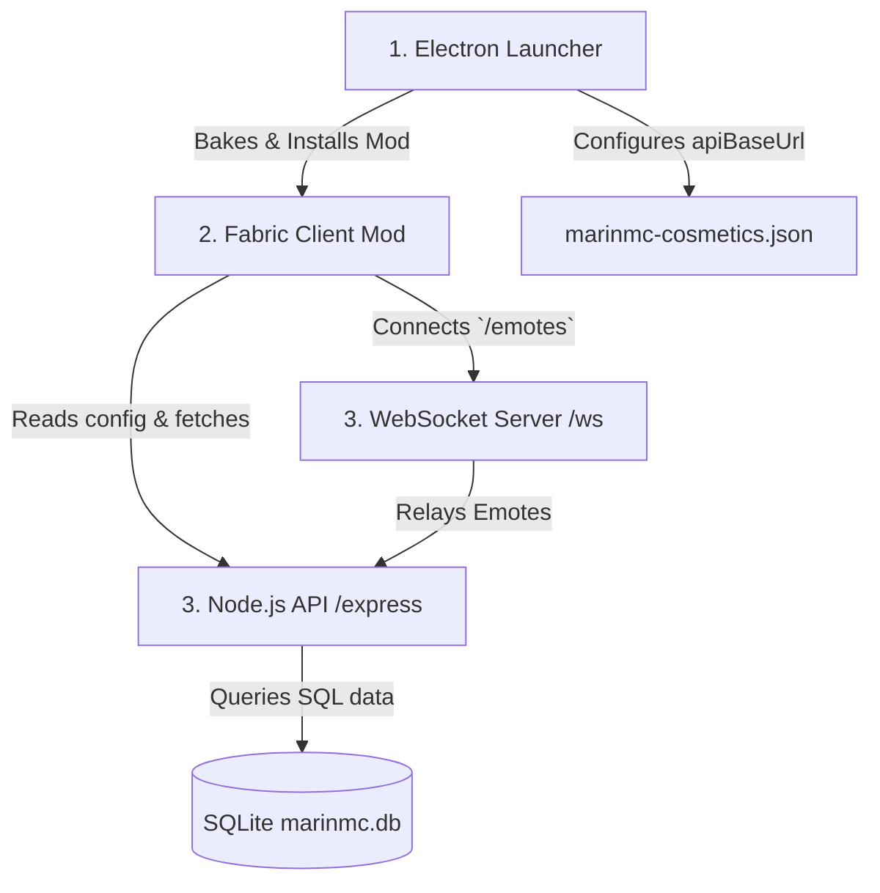

# 🎮 MarinMC Minecraft Ecosystem

Official client-side and server-side ecosystem for the **MarinMC** network. This repository integrates a custom **Electron Launcher**, a **Fabric 1.21.8 client mod** with a dynamic 3D cosmetics engine, and a **Node.js/Express API & WebSocket server** for friends, lobby chat, and real-time emote synchronization.


---

## 🏛️ Project Architecture

The repository is divided into three core subsystems working in unison:



1. **MarinMC Launcher (`/`)**: Desktop client built with Electron, React, and TypeScript. Handles game installations, performance mods downloading (GeckoLib, Sodium, etc.), account settings, and configures the API connection.
2. **MarinMC API & WS Server (`/server`)**: Backend service providing REST endpoints for user authentication, friend management, and public cosmetics metadata. It also hosts the `/emotes` WebSocket room for instant player-to-player animation sync.
3. **MarinMC Client Mod (`/marinmc-client-mod`)**: Fabric 1.21.8 client mod built in Java. Features:
   * **3D Cosmetics Engine**: Parses Blockbench `.geo.json` models and custom textures from the API, binds them to player bones, and renders them in-game using GeckoLib/Minecraft APIs.
   * **Skin & Cape Sync**: Decodes and registers custom skins/capes to the client's TextureManager.
   * **Emotecraft Custom WS**: Redirects client emote packages to our custom `/emotes` WebSocket server.

---

## 🛠️ Getting Started & Running Locally

### Prerequisites
* [Node.js](https://nodejs.org/) 20+
* [Java Development Kit (JDK)](https://adoptium.net/) 21
* [Git](https://git-scm.com/)

---

### Step 1: Start the API & WebSocket Server
```bash
cd server
npm install
npm run dev
```
The server will initialize the SQLite database (`marinmc.db`) and start listening on `http://localhost:3000`.

---

### Step 2: Start the Launcher (Dev Mode)
In another terminal, go to the root folder:
```bash
npm install
npm run dev
```
This launches the Electron interface. In developer mode, whenever you press **Play**, the launcher will:
1. Automatically run `./gradlew.bat build -x test` inside `marinmc-client-mod` to compile the client mod jar.
2. Copy the compiled jar (`marinmc-client-mod-1.0.0.jar`) to your game directory's `mods/` folder.
3. Fetch and download **GeckoLib v5.2.2** and other dependencies.
4. Launch the Minecraft client.

---

## 🧪 How to Test (Step-by-Step)

To test the cosmetics and emote synchronization system locally, follow this guide:

### A. Set Up Test Assets on Server
1. Navigate to the `server/cosmetics/` folder.
2. Put your Blockbench `.geo.json` geometry file in `server/cosmetics/models/` (e.g., `devil_wings.geo.json`).
3. Put the corresponding texture `.png` file in `server/cosmetics/textures/` (e.g., `devil_wings.png`).
4. *(Optional)* Put your animation `.json` in `server/cosmetics/animations/`.

### B. Register Cosmetics in Database
Open a SQLite GUI or use a terminal script to insert cosmetic data. For a user named `masaya46`:
```sql
-- Create a row for the user in the cosmetics table
INSERT OR REPLACE INTO cosmetics (
    username, 
    skin_type, 
    skin_val, 
    cape_url, 
    model_type, 
    wings_enabled, 
    hat_name, 
    wings_name, 
    staff_name, 
    pet_name
) VALUES (
    'masaya46', 
    'username', 
    'masaya46', 
    'https://i.imgur.com/83p1D2Q.png', -- Test cape URL
    'classic', 
    1, 
    '', 
    'devil_wings',                     -- Match filename: devil_wings.geo.json
    '', 
    ''
);
```

### C. Verify API Response
Open your browser and navigate to:
`http://localhost:3000/api/public/users/masaya46/cosmetics`
You should receive the JSON response containing the cape URL and the `wingsName` configuration.

### D. Run the Game & Verify
1. Start the launcher using `npm run dev`.
2. Login with username `masaya46` (Cracked login is supported in settings/login screen).
3. Click **PLAY** to compile the mod, download dependencies, and launch Minecraft.
4. Open a singleplayer or multiplayer world.
5. You should see your custom skin, custom cape, and the 3D devil wings rendering on your player!

### E. Test Emote Synchronization
1. Start a second game instance by launching another account username (e.g., `Alex`).
2. Join the same local LAN world or test server.
3. On player `masaya46`, press `B` to open the Emotecraft menu and trigger an emote (e.g., wave or dance).
4. On the second client (`Alex`), you should immediately see `masaya46` performing the animation in real-time, synced via the WebSocket server at `ws://localhost:3000/emotes`.

---

## 📦 Building for Production

### Build Launcher & Installer Packages
```bash
# Compile React assets & package Electron app into installers
npm run build

# Platform-specific installers (Output in release/)
npm run build:win    # Windows (.exe)
npm run build:mac    # macOS (.dmg)
npm run build:linux  # Linux (.AppImage)
```

### Build Client Mod JAR
```bash
cd marinmc-client-mod
./gradlew build -x test
```
The remapped and production-ready mod JAR will be generated under `marinmc-client-mod/build/libs/`.

---

## 📄 License

This project is licensed under the MIT License - see the [LICENSE](LICENSE) file for details.

---

**MarinMC Network** · [Website](https://marinmc.com) · [Discord](https://discord.gg/marinmc) · [Telegram](https://t.me/marinmc)
