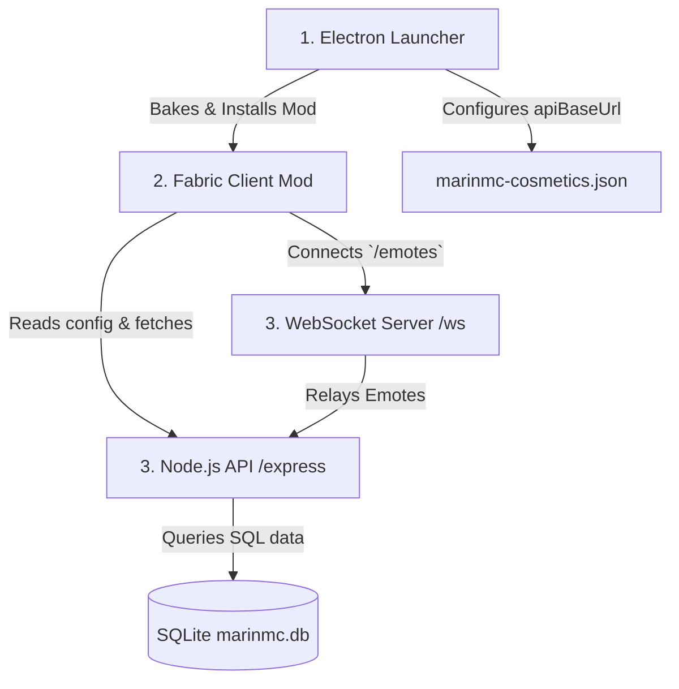

# 🎮 MarinMC Minecraft Ecosystem

Official client-side and server-side ecosystem for the **MarinMC** network. This repository integrates a custom **Electron Launcher**, a **Fabric 1.21.8 client mod** with a dynamic 3D cosmetics engine, and a **Node.js/Express API & WebSocket server** for friends, lobby chat, and real-time emote synchronization.

---

<p align="center">
  
</p>

<p align="center">
  <a href="https://github.com/musbabaff/marinmc-launcher/releases">
    
  </a>
  <a href="LICENSE">
    
  </a>
  
</p>

---

## 🏛️ Project Architecture

The ecosystem consists of three main components:



1. **MarinMC Launcher (`/`)**: Desktop client built with Electron, React, and TypeScript. Handles game installations, performance mods downloading (GeckoLib, Sodium, etc.), account settings, and configures the API connection.
2. **MarinMC API & WS Server (`/server`)**: Backend service providing REST endpoints for user authentication, friend management, and public cosmetics metadata. It also hosts the `/emotes` WebSocket room for instant player-to-player animation sync.
3. **MarinMC Client Mod (`/marinmc-client-mod`)**: Fabric 1.21.8 client mod built in Java. Features:
   * **3D Cosmetics Engine**: Parses Blockbench `.geo.json` models and custom textures from the API, binds them to player bones, and renders them in-game using GeckoLib/Minecraft APIs.
   * **Skin & Cape Sync**: Decodes and registers custom skins/capes to the client's TextureManager.
   * **Emotecraft Custom WS**: Redirects client emote packages to our custom `/emotes` WebSocket server.

---

## ✨ Features

### 🚀 Electron Launcher
* **Premium & Cracked Account Support**: Dual-mode login with session caching, Microsoft authentication, and custom offline registration.
* **Legacy Session Migration**: Automatic migration of active accounts and profile databases from legacy domains to new infrastructure.
* **Modern UI & High-fidelity Aesthetics**: Custom-designed sidebar, interactive animations, and page transitions.
* **Automatic Game Downloader**: Downloads client binaries, assets, libraries, and asset index maps directly from Mojang and Modrinth.
* **Background Selection**: Choice of themes (Classic, Lunar, Spring, and Vanilla) with customized launcher layout styles.

### 🧩 Fabric Client Mod
* **Dynamic HUD Editor**: Drag-and-drop, resize, and configure layout elements directly in-game. Features collapsing configurations, snap-to-grid, and reset options.
* **3D Waypoint System**: Add and track 3D waypoints rendered directly in the game world using Fabric API events (`WorldRenderEvents.LAST`), completely avoiding fragile obfuscated Mixin targets.
* **Fullbright Control**: Toggle night vision easily with keybinds.
* **Freelook Handler**: Perform 360-degree camera sweeps while walking.
* **RAM Cleaner**: Clear memory fragmentation dynamically with a key press.
* **Emote Synchronizer**: Real-time broadcast and receipt of emotes via custom WebSockets.

---

## 🛠️ Getting Started & Running Locally

### Prerequisites
* [Node.js](https://nodejs.org/) 20+
* [Java Development Kit (JDK)](https://adoptium.net/) 21
* [Git](https://git-scm.com/)

---

### Step 1: Start the API & WebSocket Server
```bash
cd server
npm install
npm run dev
```
The server will initialize the SQLite database (`marinmc.db`) and start listening on `http://localhost:3000`.

---

### Step 2: Start the Launcher (Dev Mode)
In another terminal, go to the root folder:
```bash
npm install
npm run dev
```
This launches the Electron interface. In developer mode, whenever you press **Play**, the launcher will:
1. Automatically run `./gradlew.bat build -x test` inside `marinmc-client-mod` to compile the client mod jar.
2. Copy the compiled jar (`marinmc-client-mod-1.0.0.jar`) to your game directory's `mods/` folder.
3. Fetch and download **GeckoLib v5.2.2** and other dependencies.
4. Launch the Minecraft client.

---

## 🧪 Development & Compilation

### Compiling the Fabric Client Mod manually
If you wish to build the Fabric client mod JAR independently:
```bash
cd marinmc-client-mod
./gradlew build
```
The compiled mod JAR will be output to `marinmc-client-mod/build/libs/marinmc-client-mod-1.0.0.jar`.

### Packaging the Electron Launcher
To package the launcher as a production build:
```bash
npm run build
```
This builds both the frontend renderer and the Electron main process, packaging them using `electron-builder`.

---

## 📄 License
This project is licensed under the MIT License - see the [LICENSE](LICENSE) file for details.
